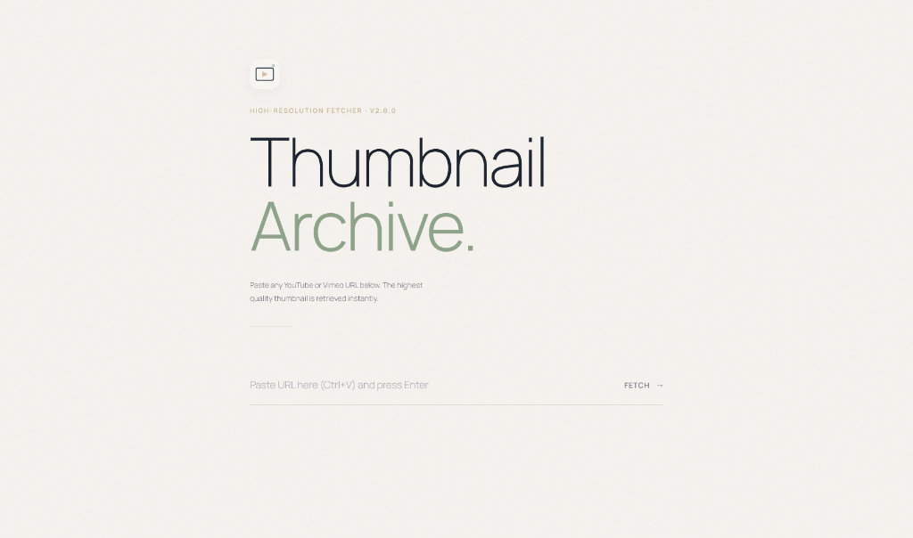
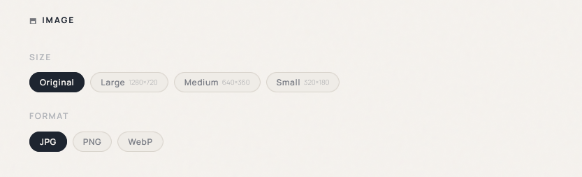

# Thumbnail Archive 🖼️

## 📥 Direct Download

> **Click to Download**: [**Download ThumbnailArchiveSetup_v3.0.0.exe**](https://github.com/4tboy/thumbnail-archive/releases/download/v3.0.0/ThumbnailArchiveSetup_v3.0.0.exe)
> 
> *Installs the application locally on your Windows PC. Automatic UAC administrator rights are requested during setup to configure the local domain host.*

---

A powerful EXE downloader that runs 100% locally, requires zero dependencies, and delivers fast, reliable, always-available performance. Designed with a sleek, native-feeling interface and local system tray integration.

---

## 🌟 Features

- **High-Resolution Fetching**: Retrieves `maxresdefault.jpg` for YouTube and highest available for Vimeo.
- **Cross-Origin Download Proxy**: Built-in backend bypasses CORS to allow immediate, direct downloading of images.
- **System Tray Integration**: Minifies to the system tray for a background, always-ready experience.
- **Premium UI**: Clean, dynamic aesthetic with toast notifications, session history, and quality toggles.
- **Zero API Keys Required**: Completely utilizes public endpoints/oEmbeds, requiring zero authentication overhead.

---

## 📸 Screenshots

*Replace the placeholder image links below with your screenshots once uploaded to GitHub.*

#### Desktop Interface


#### Advanced Options & Formats


---

## 🛠️ Architecture & Tech Stack

This project is built using a clean, modular, and industry-standard layout:

* **Backend**: Node.js, Express.js.
  * Uses Node 18 native global `fetch()` for HTTP requests (no heavy external HTTP clients).
  * System tray integration via `systray2`.
* **Frontend**: Modern HTML5, CSS3, and JavaScript.
  * Served files are placed inside the `src/frontend/` folder.
  * Standard CSS styling and pure DOM manipulation script.

### Project Layout

```
├── dist/                          # Compiled binaries (ignored by Git)
├── node_modules/                  # Dependencies (ignored by Git)
├── src/                           # Application source
│   ├── backend/                   # Express backend & tray handler
│   │   ├── server.js
│   │   └── tray.js
│   └── frontend/                  # Web app static assets
│       ├── index.html
│       ├── logo.svg
│       ├── logo.webp
│       ├── script.js
│       └── style.css
├── icon.ico                       # Native app icon
├── package.json                   # Build configs and dependencies
└── setup.iss                      # Inno Setup compilation file
```

---

## 🚀 Getting Started

### 1. Prerequisites
- **Node.js** (v18 or newer is required for native fetch).
- **Inno Setup 6** (optional, if you want to compile the installer).

### 2. Installation
Clone the repository and install dependencies:
```bash
git clone https://github.com/4tboy/thumbnail-archive.git
cd thumbnail-archive
npm install
```

### 3. Run Locally
To run the server and open the web application:
```bash
npm start
```
The application will launch in your default browser at `http://ta.tool` (or fallback port `http://localhost:23456`), and a system tray icon will appear.

### Packaging into an Executable
To compile into a standalone Windows `.exe` using `pkg`:
```bash
npm run build
```

To compile the installer package:
```bash
npm run build:installer
```

---

## 🔒 Security & Policy

This repository complies with strict publishing rules:
* Excludes all secret tokens, credentials, and configuration files via a robust `.gitignore`.
* Does not collect or log personal user information or credentials.

---

## ⚖️ Disclaimer

This application is for educational and personal use only. The author of this software is not affiliated with YouTube, Google, Vimeo, or any associated platforms. 

All video titles, creator names, and thumbnails fetched by this tool remain the copyrighted property of their respective owners and platforms. By using this tool, you agree to respect copyright laws and the Terms of Service of the respective platforms. The author assumes no responsibility or liability for any misuse of this software.

---

## 📜 License

This project is licensed under a Custom Non-Commercial License (Modified MIT License prohibiting sales) - see the [LICENSE](LICENSE) file for details.
